<div align="center">



# 🔧 Bash Scripting Mastery

[](#)
[](#)
[](#)

[](#curriculum)
[](#curriculum)
[](#)

**Stop doing repetitive tasks by hand. Write scripts that automate your entire workflow — from deployments to backups to system monitoring.**

</div>

---

## Why Learn Bash Scripting?

You already know Linux commands. Bash scripting is just putting them in a file and running them automatically.

- **Deployment scripts**: git pull → build → restart services → health check
- **Backup scripts**: compress → encrypt → upload to S3 → notify Slack
- **Monitoring scripts**: check disk, CPU, services → alert if something is wrong
- **Cron automation**: run any of the above on a schedule, without touching a keyboard

Every DevOps engineer, SRE, and sysadmin writes Bash scripts daily. This section takes you from your first `#!/bin/bash` to production-ready automation.

---

## 🗺️ Learning Order

```
01 Shell Basics  ──►  02 Variables  ──►  03 Control Flow  ──►  04 Functions
                                                                     │
08 Real World    ◄──  07 Automation  ◄──  06 Error Handling  ◄──  05 I/O
```

---

## 📚 Curriculum

### [01 — Shell Basics](./01_shell_basics/)

Everything you need to write and run your first script.

| File | What You Learn |
|------|---------------|
| [shebang_and_execution.md](./01_shell_basics/shebang_and_execution.md) | `#!/bin/bash`, `chmod +x`, `./script.sh` vs `bash script.sh` |
| [first_script.md](./01_shell_basics/first_script.md) | Write a real script from scratch, test it, run it |

---

### [02 — Variables & Data](./02_variables_and_data/)

Store and manipulate data in your scripts.

| File | What You Learn |
|------|---------------|
| [variables.md](./02_variables_and_data/variables.md) | Variable syntax, `${}`, environment variables, readonly |
| [string_operations.md](./02_variables_and_data/string_operations.md) | String slicing, substitution, length, case conversion |
| [arrays.md](./02_variables_and_data/arrays.md) | Indexed arrays, associative arrays, iteration |

---

### [03 — Control Flow](./03_control_flow/)

Make your scripts smart — decisions, loops, and branching.

| File | What You Learn |
|------|---------------|
| [conditionals.md](./03_control_flow/conditionals.md) | `if/elif/else`, `[[ ]]` test conditions, string/file/number comparisons |
| [loops.md](./03_control_flow/loops.md) | `for`, `while`, `until`, `break`, `continue` — iterate over anything |
| [case_statements.md](./03_control_flow/case_statements.md) | `case/esac` — clean multi-branch logic, menu systems |

---

### [04 — Functions](./04_functions/)

Reusable blocks of logic that make scripts maintainable.

| File | What You Learn |
|------|---------------|
| [functions.md](./04_functions/functions.md) | Define functions, pass arguments, return values |
| [scope_and_return.md](./04_functions/scope_and_return.md) | `local` variables, `$?` exit codes, returning data from functions |

---

### [05 — Input & Output](./05_input_output/)

Scripts that read input and write meaningful output.

| File | What You Learn |
|------|---------------|
| [user_input.md](./05_input_output/user_input.md) | `read`, `$1 $2 $@`, command-line argument parsing |
| [file_operations.md](./05_input_output/file_operations.md) | Read files line by line, write to files, check if files exist |
| [pipes_and_redirection.md](./05_input_output/pipes_and_redirection.md) | `|`, `>`, `>>`, `2>&1`, process substitution `<()` |

---

### [06 — Error Handling](./06_error_handling/)

Scripts that fail gracefully and tell you exactly what went wrong.

| File | What You Learn |
|------|---------------|
| [exit_codes.md](./06_error_handling/exit_codes.md) | `$?`, `set -e`, `set -o pipefail`, returning meaningful exit codes |
| [traps.md](./06_error_handling/traps.md) | `trap` — cleanup on exit, handle SIGINT/SIGTERM, lock files |
| [debugging.md](./06_error_handling/debugging.md) | `set -x`, `bash -n`, `shellcheck`, common bugs and how to find them |

---

### [07 — Automation](./07_automation/)

Schedule scripts to run automatically.

| File | What You Learn |
|------|---------------|
| [cron_jobs.md](./07_automation/cron_jobs.md) | Cron syntax, `crontab -e`, system cron in `/etc/cron.d/` |
| [scheduling.md](./07_automation/scheduling.md) | `at` for one-time jobs, systemd timers as a cron alternative |

---

### [08 — Real World Scripts](./08_real_world_scripts/)

Complete, production-ready scripts you can use immediately.

| File | What You Learn |
|------|---------------|
| [backup_scripts.md](./08_real_world_scripts/backup_scripts.md) | Compress → encrypt → upload to S3 → send notification |
| [deployment_scripts.md](./08_real_world_scripts/deployment_scripts.md) | Pull → build → test → deploy → health check → rollback |
| [system_monitoring.md](./08_real_world_scripts/system_monitoring.md) | Check CPU/disk/memory → alert when thresholds exceeded |

---

### [99 — Interview Master](./99_interview_master/)

| File | What You Learn |
|------|---------------|
| [bash_questions.md](./99_interview_master/bash_questions.md) | Real Bash scripting interview questions with full answers |

---

## 🔑 Quick Reference

```bash
#!/bin/bash
set -euo pipefail          # exit on error, undefined vars, pipe failures

# Variables
NAME="production"
echo "Deploying to: ${NAME}"

# Conditionals
if [[ -f "/etc/nginx/nginx.conf" ]]; then
    echo "nginx config found"
fi

# Loops
for server in web1 web2 web3; do
    ssh "$server" "systemctl restart myapp"
done

# Functions
check_service() {
    local service="$1"
    systemctl is-active "$service" || { echo "$service is down!"; exit 1; }
}

# Error handling
trap 'echo "Script failed on line $LINENO"' ERR
```

---

<div align="center">

[](../01_Linux/README.md)
[](../README.md)
[](../03_AWS/README.md)

**Start:** [01 Shell Basics →](./01_shell_basics/shebang_and_execution.md)

</div>
