<div align="center">



# 🏗️ Terraform Mastery

[](#)
[](#)
[](#)

[](#curriculum)
[](#curriculum)
[](#)

**Stop clicking in the AWS console. Write infrastructure as code — repeatable, version-controlled, and deployable with one command.**

</div>

---

## Why Terraform?

Imagine you just manually clicked through the AWS console for 2 hours setting up a VPC, 3 subnets, an EC2, an RDS, and a load balancer. Now you need to do it again for staging. And again for production.

Terraform lets you write that infrastructure once in code, and deploy it 100 times with `terraform apply`.

- **Version control your infrastructure** — track changes in git like application code
- **Destroy and recreate** any environment in minutes
- **Works with AWS, GCP, Azure, and 1,000+ other providers**
- **Industry standard** — used at virtually every company running infrastructure at scale

---

## 🗺️ Learning Order

```
01 Introduction  ──►  02 HCL Basics  ──►  03 Providers/Resources  ──►  04 Variables/Outputs
                                                                               │
09 Best Practices  ◄──  08 AWS + Terraform  ◄──  07 Workspaces  ◄──  05/06 State & Modules
```

---

## 📚 Curriculum

### [01 — Introduction](./01_introduction/)

Understand what Terraform is and how it fits into the DevOps toolchain.

| File | What You Learn |
|------|---------------|
| [what_is_terraform.md](./01_introduction/what_is_terraform.md) | IaC concept, how Terraform works, the plan/apply/destroy cycle |
| [installation.md](./01_introduction/installation.md) | Install Terraform on macOS, Linux, Windows; first `terraform init` |
| [terraform_vs_others.md](./01_introduction/terraform_vs_others.md) | Terraform vs CloudFormation vs Pulumi vs CDK — when to use which |

---

### [02 — HCL Basics](./02_hcl_basics/)

HCL (HashiCorp Configuration Language) is what Terraform code is written in.

| File | What You Learn |
|------|---------------|
| [syntax.md](./02_hcl_basics/syntax.md) | Blocks, arguments, identifiers, comments, file structure |
| [data_types.md](./02_hcl_basics/data_types.md) | String, number, bool, list, map, object, tuple |
| [expressions.md](./02_hcl_basics/expressions.md) | References, operators, conditionals, `for` expressions, `count` |

---

### [03 — Providers & Resources](./03_providers_resources/)

Providers connect Terraform to cloud platforms. Resources are the things you create.

| File | What You Learn |
|------|---------------|
| [providers.md](./03_providers_resources/providers.md) | Configure the AWS provider, authentication, aliases, versioning |
| [resources.md](./03_providers_resources/resources.md) | `resource` blocks, meta-arguments (`depends_on`, `lifecycle`, `count`) |
| [data_sources.md](./03_providers_resources/data_sources.md) | `data` blocks — read existing infrastructure without managing it |

---

### [04 — Variables & Outputs](./04_variables_outputs/)

Parameterize your configurations so they work across environments.

| File | What You Learn |
|------|---------------|
| [variables.md](./04_variables_outputs/variables.md) | Input variables, `variable` blocks, `.tfvars` files, validation |
| [outputs.md](./04_variables_outputs/outputs.md) | Output values, sharing data between modules, sensitive outputs |
| [locals.md](./04_variables_outputs/locals.md) | `locals` blocks — computed intermediate values, DRY configurations |

---

### [05 — State Management](./05_state_management/)

Terraform's state file tracks everything it manages. Getting state right is critical.

| File | What You Learn |
|------|---------------|
| [state_file.md](./05_state_management/state_file.md) | What is `terraform.tfstate`, why it exists, what happens if it's wrong |
| [remote_state.md](./05_state_management/remote_state.md) | S3 + DynamoDB backend, state locking, sharing state between teams |
| [state_commands.md](./05_state_management/state_commands.md) | `terraform state list/show/mv/rm` — manage state without destroying |

---

### [06 — Modules](./06_modules/)

Reusable, shareable blocks of infrastructure — the building blocks of large Terraform codebases.

| File | What You Learn |
|------|---------------|
| [creating_modules.md](./06_modules/creating_modules.md) | Module structure, inputs, outputs, calling modules |
| [module_composition.md](./06_modules/module_composition.md) | Compose multiple modules, pass outputs as inputs, dependency graphs |
| [module_registry.md](./06_modules/module_registry.md) | Terraform Registry — use community modules for VPC, EKS, RDS |

---

### [07 — Workspaces](./07_workspaces/)

Manage multiple environments (dev/staging/prod) with one codebase.

| File | What You Learn |
|------|---------------|
| [workspaces.md](./07_workspaces/workspaces.md) | `terraform workspace new/select`, workspace-aware configurations |
| [environments.md](./07_workspaces/environments.md) | Workspace patterns vs directory-per-environment, pros and cons |

---

### [08 — AWS with Terraform](./08_aws_with_terraform/)

Provision real AWS infrastructure with Terraform.

| File | What You Learn |
|------|---------------|
| [ec2.md](./08_aws_with_terraform/ec2.md) | Launch EC2 with security groups, key pairs, user data |
| [vpc.md](./08_aws_with_terraform/vpc.md) | Full VPC: subnets, route tables, IGW, NAT gateway |
| [s3.md](./08_aws_with_terraform/s3.md) | S3 buckets with versioning, encryption, lifecycle rules |
| [rds.md](./08_aws_with_terraform/rds.md) | RDS instance with subnet group, parameter group, backups |
| [iam.md](./08_aws_with_terraform/iam.md) | IAM roles, policies, instance profiles for EC2/Lambda |

---

### [09 — Best Practices](./09_best_practices/)

How senior engineers structure and maintain Terraform at scale.

| File | What You Learn |
|------|---------------|
| [code_organization.md](./09_best_practices/code_organization.md) | File layout, naming conventions, module boundaries, monorepo vs polyrepo |
| [security.md](./09_best_practices/security.md) | Never commit secrets, `sensitive = true`, Vault integration, SAST |
| [ci_cd_integration.md](./09_best_practices/ci_cd_integration.md) | `terraform plan` in PR checks, `terraform apply` in CI/CD, Atlantis |

---

### [99 — Interview Master](./99_interview_master/)

| File | What You Learn |
|------|---------------|
| [terraform_questions.md](./99_interview_master/terraform_questions.md) | Real Terraform interview questions from DevOps/SRE/Platform roles |

---

## 🔑 Quick Reference

```hcl
# Provider
terraform {
  required_providers {
    aws = { source = "hashicorp/aws", version = "~> 5.0" }
  }
  backend "s3" {
    bucket         = "my-tfstate"
    key            = "prod/terraform.tfstate"
    region         = "us-east-1"
    dynamodb_table = "tf-lock"
  }
}

provider "aws" { region = "us-east-1" }

# Variable
variable "instance_type" {
  type    = string
  default = "t3.micro"
}

# Resource
resource "aws_instance" "web" {
  ami           = data.aws_ami.ubuntu.id
  instance_type = var.instance_type
  tags = { Name = "web-server" }
}

# Output
output "public_ip" {
  value = aws_instance.web.public_ip
}
```

```bash
terraform init      # download providers
terraform plan      # preview changes
terraform apply     # deploy
terraform destroy   # tear down
```

---

<div align="center">

[](../03_AWS/README.md)
[](../README.md)

**Start:** [01 What is Terraform →](./01_introduction/what_is_terraform.md)

</div>
