**Absolute Beginner → Production Architect · Story-Based · Visual · Console-Accurate**

## What Is This?

A complete AWS mastery journey — starting from **what cloud computing is**, through every core AWS service, all the way to designing production-grade AI-powered architectures and passing certification exams.

Every topic is taught with:
- **Story-based analogies** so concepts click intuitively
- **Visual diagrams** (Mermaid + ASCII) showing how things connect
- **Console walkthroughs** matching exactly what you see in AWS
- **Real-world code examples** from actual production systems
- **Interview Q&A** to nail technical interviews

> You don't need prior cloud experience. Just curiosity and a free AWS account.

---

## Learning Roadmap

| # | Stage | What You Learn | Level |
|---|-------|---------------|-------|
| 🟢 **01** | [Cloud Foundations](./stage-01_cloud_foundations/theory.md) | What is cloud? IaaS/PaaS/SaaS, pricing models | Beginner |
| 🟢 **02** | [Global Infrastructure](./stage-02_global_infrastructure/theory.md) | Regions, AZs, Edge Locations, Shared Responsibility | Beginner |
| 🟡 **03** | [Core Compute](./stage-03_compute/) | EC2, Auto Scaling, Load Balancers, Elastic Beanstalk | Beginner |
| 🟡 **04** | [Storage Systems](./stage-04_storage/) | S3, EBS, EFS, Storage Classes | Beginner |
| 🔵 **05** | [Networking](./stage-05_networking/) | VPC, Subnets, Route 53, CloudFront, NAT, Security Groups | Intermediate |
| 🔵 **06** | [Identity & Security](./stage-06_security/) | IAM, KMS, Cognito, WAF, GuardDuty, Security Hub | Intermediate |
| 🔵 **07** | [Databases](./stage-07_databases/) | RDS, Aurora, DynamoDB, ElastiCache | Intermediate |
| 🔴 **08** | [Monitoring & Observability](./stage-08_monitoring/) | CloudWatch, CloudTrail, X-Ray, OpenTelemetry, ADOT | Intermediate |
| 🔴 **09** | [Infrastructure as Code](./stage-09_iac/) | CloudFormation, CDK, Terraform | Advanced |
| 🔴 **10** | [Containers](./stage-10_containers/) | ECS, EKS, Fargate, ECR, Kubernetes | Advanced |
| 🟣 **11** | [Serverless](./stage-11_serverless/) | Lambda, API Gateway, AppSync, SQS/SNS, EventBridge, Step Functions | Advanced |
| 🟣 **12** | [Data & Analytics](./stage-12_data_analytics/) | Kinesis, Flink, Athena, Glue, Redshift, EMR, Lake Formation | Advanced |
| 🟣 **13** | [DevOps & CI/CD](./stage-13_devops_cicd/) | CodePipeline, CodeBuild, CodeDeploy, GitHub Actions | Advanced |
| ⚫ **14** | [System Architecture](./stage-14_architecture/) | HA patterns, Well-Architected 6 Pillars, DR strategies, FIS | Expert |
| ⚫ **15** | [Cost Optimization](./stage-15_cost_optimization/theory.md) | Pricing, Reserved, Spot, Savings Plans, FinOps | Expert |
| 🤖 **16** | [AI & Machine Learning](./stage-16_ai_ml/) | Bedrock, Agents, RAG, SageMaker, Rekognition, Q | Expert |
| 🏆 **99** | [Interview Master](./stage-99_interview_master/README.md) · [Scenarios](./stage-99_interview_master/scenarios.md) | SAA-C03, DVA-C02, SAP-C02, Scenario Q&A | All levels |

**Total: 43 learning files across 16 stages**

---

## Skill Level Guide

<strong>🟢 Beginner — Must-Know Services (Start Here)</strong>

> If you're new to AWS, these are the 10 services every cloud engineer uses daily. Master these first.

| Badge | Service | What It Does | Start Here |
|-------|---------|-------------|------------|
|  | **EC2** | Run any workload on a virtual server | [ec2.md](./stage-03_compute/ec2.md) |
|  | **S3** | Store files, images, backups — infinitely | [s3.md](./stage-04_storage/s3.md) |
|  | **IAM** | Control who can do what on AWS | [iam.md](./stage-06_security/iam.md) |
|  | **VPC** | Your private network inside AWS | [vpc.md](./stage-05_networking/vpc.md) |
|  | **RDS / Aurora** | Managed MySQL/Postgres — no patching | [rds_aurora.md](./stage-07_databases/rds_aurora.md) |
|  | **Lambda** | Run code without managing any server | [lambda.md](./stage-11_serverless/lambda.md) |
|  | **CloudWatch** | Metrics, logs, alarms — know what's broken | [cloudwatch.md](./stage-08_monitoring/cloudwatch.md) |
|  | **Route 53** | DNS — point your domain to AWS resources | [route53_cloudfront.md](./stage-05_networking/route53_cloudfront.md) |
|  | **CloudFront** | Serve content fast from 450+ edge locations | [route53_cloudfront.md](./stage-05_networking/route53_cloudfront.md) |
|  | **Cloud Concepts** | IaaS/PaaS/SaaS, regions, pricing models | [theory.md](./stage-01_cloud_foundations/theory.md) |

**Goal:** Launch an EC2, upload to S3, set up an IAM user with MFA — all from console.

<strong>🔵 Intermediate — Building Real Applications</strong>

> You can launch resources. Now build a real multi-tier application that scales and stays secure.

| Badge | Service | What It Does | Deep Dive |
|-------|---------|-------------|-----------|
|  | **ALB + Auto Scaling** | Distribute traffic, self-heal on failure | [auto_scaling.md](./stage-03_compute/auto_scaling.md) |
|  | **DynamoDB** | NoSQL at any scale — single-digit ms reads | [dynamodb.md](./stage-07_databases/dynamodb.md) |
|  | **ElastiCache Redis** | Cache database results, sub-ms responses | [elasticache.md](./stage-07_databases/elasticache.md) |
|  | **EBS / EFS** | Persistent volumes and shared file systems | [ebs_efs.md](./stage-04_storage/ebs_efs.md) |
|  | **SQS + SNS** | Decouple services with async messaging | [sqs_sns_eventbridge.md](./stage-11_serverless/sqs_sns_eventbridge.md) |
|  | **API Gateway** | Managed REST/HTTP APIs with auth + throttling | [api_gateway.md](./stage-11_serverless/api_gateway.md) |
|  | **Cognito** | User sign-up, JWT tokens, social login | [cognito.md](./stage-06_security/cognito.md) |
|  | **KMS + Secrets Manager** | Encrypt everything, never hardcode secrets | [kms.md](./stage-06_security/kms.md) |
|  | **ECS + Fargate** | Run Docker containers without managing VMs | [ecs.md](./stage-10_containers/ecs.md) |
|  | **CloudFormation / CDK** | Define infrastructure as code — reproducible | [cloudformation.md](./stage-09_iac/cloudformation.md) |

**Goal:** Deploy a 3-tier app (ALB → ECS → RDS) with CI/CD, monitoring, and IaC.

<strong>🔴 Advanced — Production-Grade & Scalable</strong>

> Architect systems that handle millions of users, never go down, and deploy automatically.

| Badge | Service | What It Does | Deep Dive |
|-------|---------|-------------|-----------|
|  | **EKS + Karpenter** | Full Kubernetes: pods, HPA, IRSA, auto-scaling | [eks.md](./stage-10_containers/eks.md) |
|  | **Step Functions** | Orchestrate microservices + human approvals | [step_functions.md](./stage-11_serverless/step_functions.md) |
|  | **Kinesis Streams + Firehose** | Ingest and route millions of events/sec | [kinesis.md](./stage-12_data_analytics/kinesis.md) |
|  | **Athena + Glue** | SQL on S3, serverless ETL, data catalog | [athena_glue_redshift.md](./stage-12_data_analytics/athena_glue_redshift.md) |
|  | **AppSync** | Real-time GraphQL APIs with subscriptions | [appsync.md](./stage-11_serverless/appsync.md) |
|  | **WAF + Shield + GuardDuty** | Block attacks, detect threats, auto-remediate | [waf_shield_guardduty.md](./stage-06_security/waf_shield_guardduty.md) |
|  | **CodePipeline + CodeBuild** | Automated test → build → blue/green deploy | [cicd_pipeline.md](./stage-13_devops_cicd/cicd_pipeline.md) |
|  | **CDK + Terraform** | High-level IaC: Python CDK, HCL state mgmt | [cdk_terraform.md](./stage-09_iac/cdk_terraform.md) |
|  | **Redshift** | Petabyte-scale columnar data warehouse | [athena_glue_redshift.md](./stage-12_data_analytics/athena_glue_redshift.md) |
|  | **EventBridge** | Route AWS service events to any target | [sqs_sns_eventbridge.md](./stage-11_serverless/sqs_sns_eventbridge.md) |
|  | **OpenTelemetry (ADOT)** | Distributed traces, metrics, logs — vendor-neutral | [otel.md](./stage-08_monitoring/otel.md) |

**Goal:** Build an event-driven microservices system with full observability and automated rollbacks.

<strong>⚫ Expert — Architect & AI-Powered Systems</strong>

> Design multi-region, fault-tolerant, AI-powered systems that scale to any demand.

| Badge | Service | What It Does | Deep Dive |
|-------|---------|-------------|-----------|
|  | **Amazon Bedrock** | Call Claude, Llama, Titan — pay per token | [bedrock.md](./stage-16_ai_ml/bedrock.md) |
|  | **Bedrock Agents** | ReAct reasoning loop + Lambda tools + multi-turn | [bedrock_agents.md](./stage-16_ai_ml/bedrock_agents.md) |
|  | **Knowledge Bases (RAG)** | Grounded answers from your private documents | [bedrock_knowledge_bases.md](./stage-16_ai_ml/bedrock_knowledge_bases.md) |
|  | **SageMaker** | Train + fine-tune + deploy your own ML models | [sagemaker.md](./stage-16_ai_ml/sagemaker.md) |
|  | **HA Architecture** | Multi-AZ, Multi-Region, Active-Active patterns | [high_availability.md](./stage-14_architecture/high_availability.md) |
|  | **Well-Architected** | 6 pillars framework for production-grade design | [well_architected.md](./stage-14_architecture/well_architected.md) |
|  | **Disaster Recovery** | Backup/Restore → Pilot Light → Active-Active | [disaster_recovery.md](./stage-14_architecture/disaster_recovery.md) |
|  | **EMR + Flink** | Petabyte-scale Spark, real-time streaming SQL | [emr_lake_formation_flink.md](./stage-12_data_analytics/emr_lake_formation_flink.md) |
|  | **Guardrails + Amazon Q** | PII redaction, content safety, enterprise AI | [guardrails_amazon_q.md](./stage-16_ai_ml/guardrails_amazon_q.md) |
|  | **Scenario Interviews** | Architecture + scenario Q&A for senior roles | [scenarios.md](./stage-99_interview_master/scenarios.md) |

**Goal:** Design a production AI-powered, multi-region SaaS architecture — then explain it in an interview.

---

## Choose Your Learning Path

<strong>🟢 Complete Beginner — I've never used AWS (Start Here!)</strong>

> Goal: Understand cloud computing, set up your AWS account, and launch your first resource.

| Step | Module | What You'll Learn |
|------|--------|-------------------|
| 1 | [Cloud Foundations](./stage-01_cloud_foundations/theory.md) | What is cloud, IaaS/PaaS/SaaS, on-premise vs cloud |
| 2 | [Global Infrastructure](./stage-02_global_infrastructure/theory.md) | Regions, AZs, edge locations, shared responsibility |
| 3 | [IAM Basics](./stage-06_security/iam.md) | Create users, groups, MFA — secure your account first |
| 4 | [EC2 — Launch Your First Server](./stage-03_compute/ec2.md) | Instance types, AMI, key pairs, connect via SSH |
| 5 | [S3 — Store Your First File](./stage-04_storage/s3.md) | Buckets, upload files, static website hosting |
| 6 | [VPC Basics](./stage-05_networking/vpc.md) | What is a VPC, public vs private subnets |

**Prerequisite:** Just a web browser and curiosity. Free AWS account recommended.

<strong>🔵 Cloud Practitioner — Building real applications on AWS</strong>

> Goal: Deploy a full-stack application on AWS with database, networking, and security.

| Step | Module | What You'll Learn |
|------|--------|-------------------|
| 1 | [EC2 + Auto Scaling + ALB](./stage-03_compute/auto_scaling.md) | Scale automatically, load balance across AZs |
| 2 | [VPC Deep Dive](./stage-05_networking/vpc.md) | Multi-tier network: public/private/DB subnets |
| 3 | [Route 53 + CloudFront](./stage-05_networking/route53_cloudfront.md) | DNS routing, CDN, global content delivery |
| 4 | [RDS & Aurora](./stage-07_databases/rds_aurora.md) | Managed databases, Multi-AZ, read replicas |
| 5 | [DynamoDB](./stage-07_databases/dynamodb.md) | NoSQL, serverless, autoscaling capacity |
| 6 | [CloudWatch & Monitoring](./stage-08_monitoring/cloudwatch.md) | Metrics, alarms, dashboards, log insights |

**Prerequisite:** Complete Beginner path.

<strong>🔴 Solutions Architect — Designing scalable, resilient systems</strong>

> Goal: Design and deploy production-grade, highly available AWS architectures.

| Step | Module | What You'll Learn |
|------|--------|-------------------|
| 1 | [ECS + EKS Containers](./stage-10_containers/ecs.md) | Docker on AWS, Fargate, Kubernetes with IRSA |
| 2 | [Lambda + API Gateway](./stage-11_serverless/lambda.md) | Event-driven, pay-per-invocation APIs |
| 3 | [SQS, SNS & EventBridge](./stage-11_serverless/sqs_sns_eventbridge.md) | Async decoupling, fan-out, event routing |
| 4 | [Step Functions](./stage-11_serverless/step_functions.md) | Serverless workflow orchestration |
| 5 | [WAF, GuardDuty & Security](./stage-06_security/waf_shield_guardduty.md) | KMS, Secrets Manager, WAF, threat detection |
| 6 | [OpenTelemetry on AWS](./stage-08_monitoring/otel.md) | Distributed tracing, ADOT, ECS/EKS/Lambda instrumentation |
| 7 | [High Availability Patterns](./stage-14_architecture/high_availability.md) | Multi-AZ, Multi-Region, DR strategies |
| 8 | [Well-Architected 6 Pillars](./stage-14_architecture/well_architected.md) | OpEx, Security, Reliability, Performance, Cost, Sustainability |
| 9 | [Disaster Recovery](./stage-14_architecture/disaster_recovery.md) | RTO/RPO, AWS Backup, FIS chaos engineering |

**Prerequisite:** Cloud Practitioner path.

<strong>🤖 AI Builder — Building AI agents and intelligent applications</strong>

> Goal: Build production-ready AI features using AWS Bedrock, Agents, and pre-built AI services.

| Step | Module | What You'll Learn |
|------|--------|-------------------|
| 1 | [Amazon Bedrock](./stage-16_ai_ml/bedrock.md) | Foundation models: Claude, Llama, Titan — API + streaming |
| 2 | [Bedrock Agents](./stage-16_ai_ml/bedrock_agents.md) | Build AI agents with tools, ReAct loop, multi-turn |
| 3 | [Knowledge Bases (RAG)](./stage-16_ai_ml/bedrock_knowledge_bases.md) | Vector search, document ingestion, grounded answers |
| 4 | [Guardrails & Amazon Q](./stage-16_ai_ml/guardrails_amazon_q.md) | Content safety, PII redaction, Q Business + Q Developer |
| 5 | [SageMaker](./stage-16_ai_ml/sagemaker.md) | Train custom models, fine-tune LLMs, deploy endpoints |
| 6 | [Pre-Built AI Services](./stage-16_ai_ml/ai_services.md) | Rekognition, Textract, Transcribe, Comprehend, Personalize |

**Prerequisite:** Serverless fundamentals (Lambda, API Gateway, S3).

<strong>🏆 Certification + Interview Path — SAA-C03, DVA-C02, SAP-C02</strong>

> Goal: Pass AWS certifications and ace any cloud architecture interview.

| Step | Module | What You'll Learn |
|------|--------|-------------------|
| 1 | [Data & Analytics](./stage-12_data_analytics/kinesis.md) | Kinesis, Glue, Athena, Redshift |
| 2 | [DevOps & CI/CD](./stage-13_devops_cicd/cicd_pipeline.md) | Full deployment pipelines on AWS |
| 3 | [Infrastructure as Code](./stage-09_iac/cloudformation.md) | CloudFormation, CDK, Terraform |
| 4 | [Cost Optimization](./stage-15_cost_optimization/theory.md) | Reserved, Spot, Savings Plans, FinOps |
| 5 | [Architecture Patterns](./stage-14_architecture/high_availability.md) | HA/DR patterns, Well-Architected review |
| 6 | [Interview Master](./stage-99_interview_master/README.md) · [Scenario Q&A](./stage-99_interview_master/scenarios.md) | Scenario Q&A, service comparison, rapid fire |

---

## Full Curriculum

<strong>🟢 Stage 1–2 — Foundations</strong>

| File | Topic | Key Concepts |
|------|-------|-------------|
| [theory.md](./stage-01_cloud_foundations/theory.md) | Cloud Computing Foundations | IaaS · PaaS · SaaS · On-premise vs Cloud · Elasticity · Pricing |
| [theory.md](./stage-02_global_infrastructure/theory.md) | AWS Global Infrastructure | Regions · AZs · Edge Locations · Shared Responsibility · Free Tier |

<strong>🟡 Stage 3–4 — Compute & Storage</strong>

| File | Topic | Key Concepts |
|------|-------|-------------|
| [ec2.md](./stage-03_compute/ec2.md) | EC2 — Virtual Machines | Instance Types · AMI · Pricing Models · Security Groups · User Data |
| [auto_scaling.md](./stage-03_compute/auto_scaling.md) | Auto Scaling & Load Balancing | ASG · ALB · NLB · Target Groups · Health Checks · Sticky Sessions |
| [elastic_beanstalk.md](./stage-03_compute/elastic_beanstalk.md) | Elastic Beanstalk | PaaS deploy · Environments · Platform versions · Blue/Green |
| [s3.md](./stage-04_storage/s3.md) | S3 — Object Storage | Buckets · Storage Classes · Lifecycle · Versioning · Static Hosting · CRR |
| [ebs_efs.md](./stage-04_storage/ebs_efs.md) | EBS & EFS — Block & File Storage | Volume Types · Snapshots · Multi-attach · Shared NFS |

<strong>🔵 Stage 5–7 — Networking, Security & Databases</strong>

| File | Topic | Key Concepts |
|------|-------|-------------|
| [vpc.md](./stage-05_networking/vpc.md) | VPC — Virtual Private Cloud | Subnets · Route Tables · IGW · NAT GW · VPC Peering · Transit GW |
| [route53_cloudfront.md](./stage-05_networking/route53_cloudfront.md) | Route 53 & CloudFront | DNS routing policies · Alias records · CDN · OAC · Signed URLs |
| [iam.md](./stage-06_security/iam.md) | IAM — Identity & Access | Users · Roles · Policies · MFA · Organizations · SCPs |
| [kms.md](./stage-06_security/kms.md) | KMS & Encryption | CMKs · Key rotation · Envelope encryption · Secrets Manager |
| [cognito.md](./stage-06_security/cognito.md) | Cognito — User Auth | User Pools · Identity Pools · JWT · Social Login · IRSA |
| [waf_shield_guardduty.md](./stage-06_security/waf_shield_guardduty.md) | WAF, Shield & GuardDuty | Web ACL rules · DDoS protection · Threat detection · Macie · Inspector |
| [rds_aurora.md](./stage-07_databases/rds_aurora.md) | RDS & Aurora | Engines · Multi-AZ · Read Replicas · Aurora Serverless · RDS Proxy |
| [dynamodb.md](./stage-07_databases/dynamodb.md) | DynamoDB | Keys · GSI/LSI · DAX · Streams · Capacity modes · Global Tables |
| [elasticache.md](./stage-07_databases/elasticache.md) | ElastiCache Redis | Cluster modes · Eviction · Session storage · Rate limiting · Leaderboards |

<strong>🔴 Stage 8–10 — Observability, IaC & Containers</strong>

| File | Topic | Key Concepts |
|------|-------|-------------|
| [cloudwatch.md](./stage-08_monitoring/cloudwatch.md) | CloudWatch | Metrics · Logs · Alarms · Dashboards · Log Insights · CloudTrail · X-Ray |
| [otel.md](./stage-08_monitoring/otel.md) | OpenTelemetry on AWS | ADOT · OTEL SDK · ECS sidecar · EKS DaemonSet · Lambda Layer · X-Ray · CloudWatch EMF |
| [cloudformation.md](./stage-09_iac/cloudformation.md) | CloudFormation | Templates · Stacks · Change Sets · Drift detection · Intrinsic functions |
| [cdk_terraform.md](./stage-09_iac/cdk_terraform.md) | CDK & Terraform | L2/L3 constructs · Python CDK · HCL · Remote state · Plan vs Apply |
| [ecs.md](./stage-10_containers/ecs.md) | ECS — Elastic Container Service | Task Defs · Services · Fargate · Blue/Green · ECR · Service Connect |
| [eks.md](./stage-10_containers/eks.md) | EKS — Kubernetes on AWS | Node groups · Fargate profiles · IRSA · kubectl · HPA · Karpenter |

<strong>🟣 Stage 11–13 — Serverless, Data & DevOps</strong>

| File | Topic | Key Concepts |
|------|-------|-------------|
| [lambda.md](./stage-11_serverless/lambda.md) | Lambda — Serverless Functions | Triggers · Layers · Concurrency · Cold Start · DLQ · Lambda@Edge |
| [api_gateway.md](./stage-11_serverless/api_gateway.md) | API Gateway | REST vs HTTP API · Stages · Cognito/Lambda Auth · Throttling · WebSocket |
| [appsync.md](./stage-11_serverless/appsync.md) | AppSync — Managed GraphQL | Schema · Resolvers · Subscriptions · Pipeline resolvers · Real-time sync |
| [sqs_sns_eventbridge.md](./stage-11_serverless/sqs_sns_eventbridge.md) | SQS, SNS & EventBridge | Queues · Fan-out · DLQ · FIFO · Event patterns · Scheduled rules |
| [step_functions.md](./stage-11_serverless/step_functions.md) | Step Functions | State machines · ASL · Map/Parallel · waitForTaskToken · Express vs Standard |
| [kinesis.md](./stage-12_data_analytics/kinesis.md) | Kinesis — Real-Time Streaming | Data Streams · Firehose · Shards · On-demand · Kinesis vs SQS vs SNS |
| [athena_glue_redshift.md](./stage-12_data_analytics/athena_glue_redshift.md) | Athena, Glue & Redshift | Serverless SQL · Parquet · Crawlers · ETL PySpark · MPP data warehouse |
| [emr_lake_formation_flink.md](./stage-12_data_analytics/emr_lake_formation_flink.md) | EMR, Lake Formation & Flink | Managed Spark · Column/row security · Streaming SQL · Window types |
| [cicd_pipeline.md](./stage-13_devops_cicd/cicd_pipeline.md) | CI/CD Pipeline | CodeBuild buildspec · CodeDeploy Blue/Green · CodePipeline · GitHub Actions |

<strong>⚫ Stage 14–15 — Architecture & Cost Optimization</strong>

| File | Topic | Key Concepts |
|------|-------|-------------|
| [high_availability.md](./stage-14_architecture/high_availability.md) | High Availability Architecture | Multi-AZ · Multi-Region · Active-Active · DR strategies · Circuit Breaker |
| [well_architected.md](./stage-14_architecture/well_architected.md) | 6 Pillars of Well-Architected | OpEx · Security · Reliability · Performance · Cost · Sustainability |
| [disaster_recovery.md](./stage-14_architecture/disaster_recovery.md) | Disaster Recovery & Business Continuity | RTO/RPO · Backup/Restore · Pilot Light · Warm Standby · Active-Active · FIS |
| [theory.md](./stage-15_cost_optimization/theory.md) | Cost Optimization | Pricing models · Reserved · Spot · Trusted Advisor · Cost Explorer · FinOps |

<strong>🤖 Stage 16 — AI & Machine Learning</strong>

| File | Topic | Key Concepts |
|------|-------|-------------|
| [bedrock.md](./stage-16_ai_ml/bedrock.md) | Amazon Bedrock | Foundation models · Claude/Llama/Titan · Converse API · Streaming · Embeddings |
| [bedrock_agents.md](./stage-16_ai_ml/bedrock_agents.md) | Bedrock Agents | ReAct loop · Action groups · Lambda tools · OpenAPI schema · Trace debugging |
| [bedrock_knowledge_bases.md](./stage-16_ai_ml/bedrock_knowledge_bases.md) | Knowledge Bases (RAG) | Vector search · Document ingestion · Chunking strategies · Hybrid search |
| [guardrails_amazon_q.md](./stage-16_ai_ml/guardrails_amazon_q.md) | Guardrails & Amazon Q | Content filters · PII redaction · Topic blocking · Q Business · Q Developer |
| [sagemaker.md](./stage-16_ai_ml/sagemaker.md) | SageMaker | Custom ML training · Endpoints · Autopilot · Fine-tuning LLMs · Studio |
| [ai_services.md](./stage-16_ai_ml/ai_services.md) | Pre-Built AI Services | Rekognition · Textract · Transcribe · Polly · Comprehend · Lex · Personalize |

<strong>🏆 Stage 99 — Interview Master</strong>

| File | Topic | Key Concepts |
|------|-------|-------------|
| [README.md](./stage-99_interview_master/README.md) | Interview Master | 100 Q&As · Architecture scenarios · Service comparisons · Cert prep · Rapid fire |
| [scenarios.md](./stage-99_interview_master/scenarios.md) | Scenario & Architecture Q&A | 20+ real interview scenarios · system design · trade-off decisions |

---

## Quick Service Reference

| Scenario | Best AWS Service | Why |
|----------|-----------------|-----|
| Run a virtual machine | EC2 | Full OS control, any workload |
| Run code without servers | Lambda | Pay per invocation, auto-scale |
| Container on AWS (simple) | ECS + Fargate | Managed, no cluster management |
| Container on AWS (Kubernetes) | EKS | Full K8s compatibility, IRSA |
| Store files / images / videos | S3 | Infinitely scalable object storage |
| Fast block storage for EC2 | EBS gp3 | Persistent, high IOPS |
| Shared file system (multi-EC2) | EFS | NFS mount across instances and AZs |
| SQL database (managed) | RDS / Aurora | Auto-scaling, Multi-AZ, read replicas |
| NoSQL database | DynamoDB | Serverless, single-digit ms, Global Tables |
| Cache layer | ElastiCache Redis | Sub-ms reads, session storage, pub/sub |
| Load balance HTTP traffic | ALB | Path/header-based routing, WAF integration |
| DNS + traffic routing | Route 53 | Health checks, latency/geo/failover routing |
| Global CDN | CloudFront | 450+ edge locations, OAC, WAF at edge |
| User authentication | Cognito | Sign-up/sign-in, JWT, social login |
| Async task queue | SQS | Decoupling, DLQ, visibility timeout |
| Fan-out notifications | SNS | Pub/sub to many subscribers simultaneously |
| AWS service event routing | EventBridge | Pattern matching, 100+ sources, schedules |
| **GraphQL API** | **AppSync** | **Schema + resolvers + real-time subscriptions** |
| Multi-step workflows | Step Functions | State machines, human approval, retries |
| Real-time stream processing | Kinesis | 1MB/s per shard, ordered, replayable |
| Streaming SQL / anomaly detection | Kinesis Analytics (Flink) | Tumbling/sliding windows, sub-second latency |
| Serverless SQL on S3 | Athena | Query Parquet/CSV/JSON with SQL |
| ETL pipelines | Glue | Serverless Spark, crawlers, data catalog |
| Data lake governance | Lake Formation | Column/row security, centralized permissions |
| Large-scale Spark / Hadoop | EMR Serverless | Custom ML, big data, managed cluster |
| Data warehouse | Redshift | MPP, columnar, Spectrum for S3 queries |
| Block malicious HTTP traffic | WAF | SQL injection, XSS, rate limiting, geo block |
| DDoS protection | Shield | Volumetric attack mitigation, L3/L4/L7 |
| Threat detection | GuardDuty | ML-based, CloudTrail + VPC flow + DNS logs |
| Repeatable infrastructure | CloudFormation / CDK | Templates → reproducible stacks |
| Manage metrics + alerts | CloudWatch | Dashboards, alarms, Log Insights |
| Distributed tracing (vendor-neutral) | OpenTelemetry (ADOT) | One SDK → X-Ray + CloudWatch + any backend |
| CI/CD pipeline | CodePipeline + CodeBuild | Source → Build → Test → Deploy |
| **Call foundation models (AI)** | **Bedrock** | **Claude, Llama, Titan — pay per token** |
| **Build AI agents** | **Bedrock Agents** | **ReAct loop, Lambda tools, multi-turn** |
| **Company knowledge search (AI)** | **Bedrock Knowledge Bases** | **RAG, vector store, grounded answers** |
| **Custom ML models** | **SageMaker** | **Train, tune, deploy your own models** |
| **Analyze images/video** | **Rekognition** | **Object detection, faces, moderation** |
| **Extract text from documents** | **Textract** | **OCR + form fields + tables** |
| **Speech to text** | **Transcribe** | **Real-time + batch, speaker labels** |
| **Enterprise AI assistant** | **Amazon Q Business** | **Ask questions from company docs** |

---

## Key Numbers Every AWS Engineer Should Know

| Service | Limit | Why It Matters |
|---------|-------|---------------|
| S3 max object size | 5 TB | Use multipart upload for files > 100 MB |
| Lambda max timeout | 15 min | Long jobs → Step Functions or ECS |
| Lambda max memory | 10 GB | More memory = more vCPU automatically |
| DynamoDB item size | 400 KB | Large items → store payload in S3 |
| SQS max message size | 256 KB | Use S3 pointer for large payloads |
| SQS max retention | 14 days | Messages auto-deleted after 14 days |
| SQS visibility timeout max | 12 hours | Set longer than your processing time |
| EBS gp3 max IOPS | 16,000 | Beyond this → io2 Block Express |
| Kinesis shard write | 1 MB/s | Add shards to scale throughput |
| CloudFormation stack resources | 500 | Use nested stacks beyond this |
| ECS task definition size | 64 KB | Split large task definitions |
| Bedrock Claude context window | 200K tokens | Large docs fit in one call |
| Step Functions max execution | 1 year | Use Standard workflow for long processes |
| API Gateway payload size | 10 MB | Use S3 presigned URL for large uploads |
| Lambda concurrent executions | 1,000 (default) | Request increase for high-traffic apps |

---

## Start Here

**Never used AWS?** → [Stage 01: Cloud Foundations](./stage-01_cloud_foundations/theory.md)

**Build a web app** → [EC2](./stage-03_compute/ec2.md) → [VPC](./stage-05_networking/vpc.md) → [RDS](./stage-07_databases/rds_aurora.md) → [CloudWatch](./stage-08_monitoring/cloudwatch.md)

**Go serverless** → [Lambda](./stage-11_serverless/lambda.md) → [API Gateway](./stage-11_serverless/api_gateway.md) → [DynamoDB](./stage-07_databases/dynamodb.md) → [SQS/SNS](./stage-11_serverless/sqs_sns_eventbridge.md)

**Build with containers** → [ECS](./stage-10_containers/ecs.md) → [EKS](./stage-10_containers/eks.md) → [OpenTelemetry](./stage-08_monitoring/otel.md) → [CI/CD](./stage-13_devops_cicd/cicd_pipeline.md)

**Build AI features** → [Bedrock](./stage-16_ai_ml/bedrock.md) → [Agents](./stage-16_ai_ml/bedrock_agents.md) → [Knowledge Bases](./stage-16_ai_ml/bedrock_knowledge_bases.md) → [Guardrails](./stage-16_ai_ml/guardrails_amazon_q.md)

**Prep for SAA-C03** → All stages in order → [Interview Master](./stage-99_interview_master/README.md) → [Scenario Q&A](./stage-99_interview_master/scenarios.md)

---

*AWS Complete Mastery · Story-Based · Visual · Console-Accurate · Beginner to Expert · 16 Stages · 43 Files*

