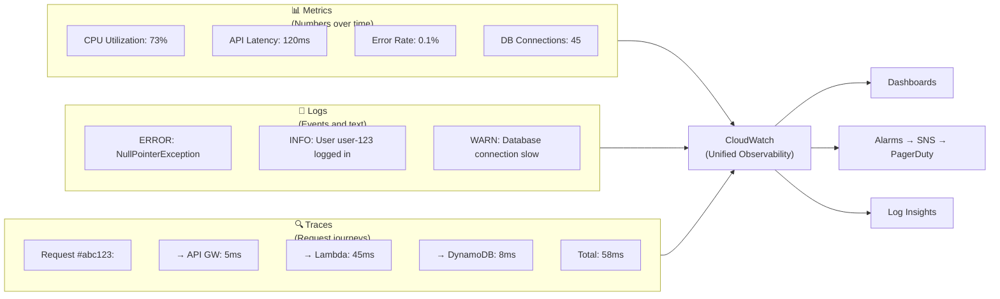

# Stage 08 — CloudWatch & Observability

> You can't manage what you can't measure. CloudWatch is your eyes and ears inside AWS.

## 1. Core Intuition

Your application is deployed. Traffic is flowing. But:
- Is the server running hot? (CPU metrics)
- Are there 500 errors? (application logs)
- Did someone delete that S3 bucket? (CloudTrail)
- Is the database responding slowly? (DB metrics)
- Should the team be paged at 3am? (alarms)

**Amazon CloudWatch** is the unified observability platform for AWS. It collects metrics, logs, traces, and events from virtually every AWS service — and lets you set alarms, build dashboards, and trigger automated actions.

## 2. The Three Pillars of Observability



## 3. CloudWatch Metrics

### Built-in vs Custom Metrics

```
Built-in Metrics (free):
  EC2:        CPUUtilization, NetworkIn/Out, DiskRead/Write
  RDS:        DatabaseConnections, FreeStorageSpace, ReadLatency
  ALB:        RequestCount, HTTPCode_Target_5XX, TargetResponseTime
  Lambda:     Invocations, Errors, Duration, Throttles, ConcurrentExecutions
  DynamoDB:   ConsumedReadCapacityUnits, SuccessfulRequestLatency
  S3:         BucketSizeBytes, NumberOfObjects (daily metrics only)

Custom Metrics (you pay per metric):
  Your app sends metrics:
    • Business metrics: OrdersPerMinute, ActiveUsers, CheckoutAttempts
    • Technical metrics: CacheHitRatio, QueueDepth, RetryCount
    • Memory usage (EC2 doesn't auto-report memory — must use CloudWatch agent)

Metric resolution:
  Standard: 1 minute intervals (default)
  High resolution: 1 second intervals ($0.30/metric/month extra)

Retention:
  < 1 min resolution: 3 hours
  1 min resolution: 15 days
  5 min resolution: 63 days
  1 hour resolution: 455 days (~15 months)
```

### Publishing Custom Metrics

```python
import boto3
cloudwatch = boto3.client('cloudwatch', region_name='us-east-1')

# Publish a custom metric
cloudwatch.put_metric_data(
    Namespace='MyApp/Orders',  # Group your metrics under namespaces
    MetricData=[
        {
            'MetricName': 'OrdersProcessed',
            'Dimensions': [
                {'Name': 'Environment', 'Value': 'production'},
                {'Name': 'Region', 'Value': 'us-east-1'}
            ],
            'Value': 42,
            'Unit': 'Count'
        },
        {
            'MetricName': 'CheckoutLatency',
            'Dimensions': [{'Name': 'Environment', 'Value': 'production'}],
            'Value': 234.5,
            'Unit': 'Milliseconds'
        }
    ]
)
```

```bash
# Or via CLI
aws cloudwatch put-metric-data \
  --namespace "MyApp/WebServer" \
  --metric-name "ActiveUsers" \
  --value 1247 \
  --unit Count
```

## 4. CloudWatch Alarms

### Alarm States

```
┌──────────────────────────────────────────────────────────┐
│  Alarm States:                                          │
│                                                          │
│  OK → metric is within acceptable range                │
│  ALARM → metric has breached threshold                  │
│  INSUFFICIENT_DATA → not enough data to evaluate        │
└──────────────────────────────────────────────────────────┘

Alarm Evaluation:
  Period: how often to evaluate (60s, 300s, etc.)
  Evaluation Periods: how many consecutive periods to check
  Datapoints to Alarm: how many periods must breach

  Example: CPU > 70% for 3 out of 5 minutes
    → 3 data points out of 5 consecutive must be above 70%
    → Prevents false alarms from brief spikes
```

### Alarm Actions

```
When alarm fires, it can:
  → Notify via SNS:
    • Email your team
    • SMS on-call engineer
    • Trigger PagerDuty/OpsGenie webhook

  → Trigger Auto Scaling:
    • Scale out EC2 instances
    • Scale in when metric recovers

  → EC2 Actions:
    • Stop, start, reboot, or terminate an instance

  → Lambda:
    • Run automated remediation

Example: High Error Rate Alarm
  Metric: HTTPCode_Target_5XX_Count
  Threshold: > 10 errors in 5 minutes
  Actions:
    OK → Resolve PagerDuty incident
    ALARM → Page on-call engineer + post to Slack via SNS
```

### Console Walkthrough — Create an Alarm

```
Console: CloudWatch → Alarms → Create alarm

Step 1: Select metric
  EC2 → By Instance ID → CPUUtilization → [your instance]
  Period: 5 minutes

Step 2: Conditions
  Threshold type: Static
  Whenever CPUUtilization is: Greater than
  Threshold: 80

Step 3: Configure actions
  Alarm state trigger: In alarm
  Select SNS topic: Create new topic
  Email endpoint: your@email.com

Step 4: Name and create
  Alarm name: EC2-High-CPU-Alert
  Create alarm

Test: SSH into EC2 and run: stress --cpu 4 --timeout 600
      Watch alarm switch from OK → ALARM → email notification!
```

## 5. CloudWatch Logs

### Log Groups, Streams, and Agents

```
Log Organization:
  Log Group     = Container for related logs (/aws/lambda/my-function)
  Log Stream    = Sequence of logs from one source (one Lambda container)
  Log Events    = Individual log entries

AWS Services → Logs Automatically:
  Lambda      → /aws/lambda/function-name
  API Gateway → /aws/apigateway/...
  ECS         → /ecs/task-definition-name
  RDS         → /aws/rds/instance/...
  VPC Flow Logs → /aws/vpc/flowlogs/...

EC2 Requires CloudWatch Agent:
  Install CloudWatch Agent on EC2 to send:
  • Application logs (/var/log/nginx/access.log)
  • System logs (/var/log/messages)
  • Custom log files
  • Memory metrics (EC2 doesn't send memory by default)

Install CloudWatch Agent:
  sudo dnf install -y amazon-cloudwatch-agent
  sudo amazon-cloudwatch-agent-config-wizard
  sudo systemctl start amazon-cloudwatch-agent
```

### CloudWatch Logs Insights — Query Your Logs

```
CloudWatch Logs Insights = SQL-like language for searching logs

Console: CloudWatch → Logs Insights

Example queries:

# Find all errors in last hour
fields @timestamp, @message
| filter @message like /ERROR/
| sort @timestamp desc
| limit 50

# Count requests by status code
fields @timestamp, status_code
| stats count(*) as request_count by status_code
| sort request_count desc

# Find slowest Lambda invocations
fields @timestamp, @duration, @requestId
| sort @duration desc
| limit 10

# Error rate calculation
fields @timestamp, @message
| stats
    sum(errorCount) as errors,
    sum(requestCount) as total,
    errors/total * 100 as errorRate
| filter ispresent(requestCount)
```

## 6. CloudWatch Dashboards

```
Create a unified view of your entire system:

Console: CloudWatch → Dashboards → Create dashboard

Add widgets:
  • Line graph: EC2 CPU across all instances
  • Number widget: Current active Lambda invocations
  • Alarm status widget: Red/Green for critical alarms
  • Log table: Latest errors from Log Insights query
  • Custom text: Service status notes

Share dashboards:
  • Share publicly (view-only, no auth required)
  • Share within your AWS organization

Example production dashboard layout:
┌────────────────┬─────────────────┬──────────────────┐
│ EC2 CPU/Memory │ RDS Connections │ Lambda Errors    │
├────────────────┼─────────────────┼──────────────────┤
│ ALB Request    │ DynamoDB        │ Alarm Status     │
│ Count + Errors │ Latency         │ (Red/Yellow/Green│
├────────────────┴─────────────────┴──────────────────┤
│ Recent Error Log Tail (CloudWatch Logs Insights)     │
└──────────────────────────────────────────────────────┘
```

## 7. CloudTrail — API Audit Trail

```
CloudWatch = Metrics and logs from your applications
CloudTrail = Record of every AWS API call made in your account

Every action in AWS = an API call
  Console click → API call
  CLI command   → API call
  SDK call      → API call
  Lambda execution → API calls

CloudTrail records:
  WHO made the call  (IAM user, role, service)
  WHAT they did      (s3:DeleteBucket, ec2:TerminateInstances)
  WHEN               (timestamp)
  WHERE from         (IP address)
  WHAT happened      (success, error, parameters)

Use cases:
  ✅ Security audit: "Who deleted that S3 bucket at 3am?"
  ✅ Compliance: Keep 7 years of audit logs (required for many industries)
  ✅ Forensics: After a security incident, trace exactly what happened
  ✅ Governance: Alert when someone creates admin IAM users

Enable CloudTrail:
  Console: CloudTrail → Create trail
    Trail name: management-trail
    Storage location: Create new S3 bucket
    Log file validation: Enabled
    CloudWatch Logs integration: Enable
    Event types: Management events (all) + Data events (S3 object operations)
```

### CloudTrail vs CloudWatch

```
                CloudTrail           CloudWatch
Purpose:        API audit trail      Metrics + logs + alarms
Who made calls? ✅ YES               ❌ Not directly
App logs?       ❌ No                ✅ YES
CPU metrics?    ❌ No                ✅ YES
Alarms?         ❌ No                ✅ YES
Cost:           $2/100K events       Varies by usage
Retention:      90 days free, then S3  Varies (up to 15 months)
```

## 8. AWS X-Ray — Distributed Tracing

```
Problem: A request goes through:
  API Gateway → Lambda → DynamoDB → Lambda → S3

  Total request: 800ms
  Which step was slow? You can't tell from logs alone.

Solution: X-Ray Distributed Tracing

  Each component adds a trace segment.
  X-Ray assembles the full trace.
  You see EXACTLY where time was spent.

Trace visualization:
  POST /api/order (total: 800ms)
  ├── API Gateway:        5ms
  ├── Lambda (validate): 15ms
  │   └── DynamoDB read: 8ms
  ├── Lambda (process):  650ms  ← 81% of time here!
  │   ├── DynamoDB write: 12ms
  │   └── S3 upload:     620ms  ← S3 is the bottleneck!
  └── Lambda (notify):   130ms
      └── SES send:      125ms

Now you know: optimize S3 upload in process Lambda.

Enable X-Ray:
  Lambda: Configuration → Monitoring → Active tracing → Enable
  EC2: Install X-Ray daemon + add SDK
  API Gateway: Stage → Logs/Tracing → Enable X-Ray Tracing

Console: X-Ray → Service Map (visual graph of your architecture + latencies)
```

## 9. Amazon EventBridge (CloudWatch Events)

```
EventBridge = Serverless event bus
  Route events from AWS services, your apps, and SaaS to targets

Two main patterns:

1. Scheduled Rules (cron replacement):
   Every 5 minutes → invoke Lambda
   Every Monday 9am → run Step Functions state machine
   Daily at midnight → trigger ECS task (database backup)

   Console: EventBridge → Rules → Create rule → Schedule

2. Event Pattern Rules (react to events):
   EC2 instance state change → notify team via SNS
   S3 object created in bucket X → trigger Lambda
   RDS snapshot complete → update database status
   IAM user created → alert security team

   Console: EventBridge → Rules → Create rule → Event pattern

EventBridge Pipes (new 2022):
  Point-to-point connections between sources and targets
  Built-in filtering and enrichment
  DynamoDB Stream → filter events → enrich with Lambda → SQS
```

## 10. Common Mistakes

```
❌ Not installing CloudWatch Agent on EC2
   → Can't see memory, disk, or custom app logs in CloudWatch
   ✅ Install CloudWatch Agent on all EC2 instances

❌ Using only EC2-level health checks in Auto Scaling
   → Instance may be up (EC2 is running) but app is crashed
   ✅ Enable ELB health checks in ASG (checks application level)

❌ Not setting up billing alarms
   → Get a $500 bill surprise
   ✅ CloudWatch → Billing Alarm → Alert at $10, $50, $100

❌ Keeping CloudTrail logs in CloudTrail (90 days)
   → Compliance requires longer retention
   ✅ Configure CloudTrail to deliver to S3 + S3 lifecycle to Glacier

❌ Ignoring high-resolution metrics for latency
   → 1-minute metrics miss spikes that last 30 seconds
   ✅ Use 1-second high-resolution metrics for latency-sensitive apps
```

## 11. Interview Perspective

**Q: What is the difference between CloudWatch and CloudTrail?**
CloudWatch monitors the health and performance of applications and infrastructure (metrics, logs, alarms). CloudTrail audits all AWS API calls — who did what, when, from where. CloudWatch answers "Is my app healthy?" CloudTrail answers "Who deleted that database?"

**Q: How would you investigate why your Lambda function's error rate spiked?**
(1) CloudWatch → Lambda metrics → Errors graph — see when errors started. (2) CloudWatch Logs Insights — query `/aws/lambda/my-function` for ERROR messages in that time window. (3) X-Ray traces — find failing traces to see exactly which service or code path is failing. (4) Check CloudTrail — was there a configuration change (env var, code deploy) before errors started?

---

**[🏠 Back to README](../README.md)**

**Prev:** [← ElastiCache Redis](../stage-07_databases/elasticache.md) &nbsp;|&nbsp; **Next:** [OpenTelemetry on AWS →](../stage-08_monitoring/otel.md)

**Related Topics:** [CloudFormation](../stage-09_iac/cloudformation.md) · [Lambda](../stage-11_serverless/lambda.md) · [CI/CD Pipeline](../stage-13_devops_cicd/cicd_pipeline.md) · [Well-Architected Framework](../stage-14_architecture/well_architected.md)
