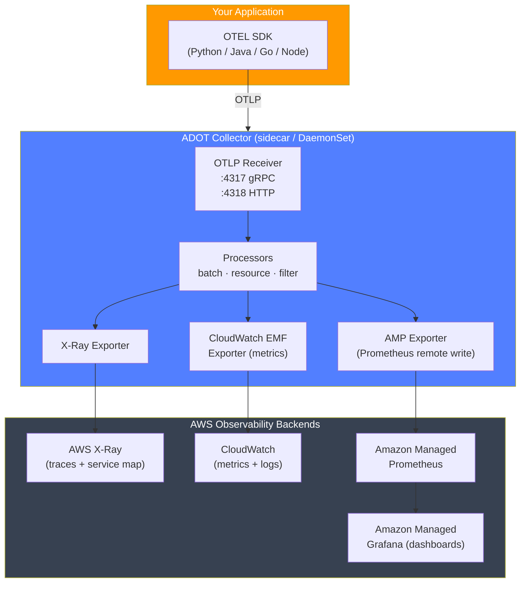
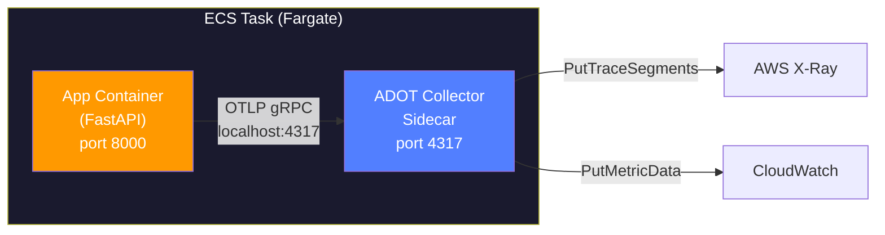

# Stage 08b — OpenTelemetry on AWS

> Instrument once, export anywhere — and route everything to AWS-native backends without touching your application code.

---

## 1. Core Intuition

Your engineering team built a microservices platform on AWS — 12 services, ECS Fargate, RDS, DynamoDB, ElastiCache. Each service logs to CloudWatch. But when an order fails, finding the root cause means:

- Digging through CloudWatch Logs Insights across 12 log groups
- Guessing which service caused it
- No way to see the chain of calls that led to the failure

A senior engineer adds OpenTelemetry. Now when an order fails you see:

```
Trace: order-checkout-abc123  [FAILED]  total: 2,341ms

  POST /checkout              orders-svc      [===========================] 2,341ms ERROR
  ├── GET /cart/validate      cart-svc        [=======] 643ms   OK
  ├── POST /inventory/reserve inventory-svc   [=====] 512ms    OK
  ├── POST /payment/charge    payment-svc     [======] 622ms   ERROR ← HERE
  │   └── INSERT payments     RDS             [=====] 618ms   TIMEOUT
  └── (skipped: notification)
```

In 10 seconds you know: payment-svc RDS write is timing out. That's OpenTelemetry on AWS.

---

## 2. What Is OpenTelemetry — The 5-Minute Explanation

Before 2019, every observability vendor had their own proprietary SDK:

```
The old world (vendor lock-in):

  Your app          SDK                 Backend
  ──────────────────────────────────────────────
  orders-svc   → Datadog SDK       → Datadog
  payment-svc  → New Relic SDK     → New Relic
  inventory    → AWS X-Ray SDK     → AWS X-Ray

  Problem: 3 different SDKs, 3 different APIs.
  Want to switch vendors? Rewrite all instrumentation.
  Want all data in one place? Impossible.
  New hire? Must learn each SDK separately.
```

In 2019, Google, Microsoft, and the CNCF merged two competing open standards (OpenTracing + OpenCensus) into **OpenTelemetry** — a single, vendor-neutral specification backed by every major cloud and observability vendor.

```
The OTEL world:

  Your app          One SDK             Any backend
  ──────────────────────────────────────────────────────
  orders-svc   ─┐
  payment-svc   ├→ OTEL SDK → Collector ─→ AWS X-Ray
  inventory    ─┘                       ─→ Datadog
                                        ─→ Grafana Tempo
                                        ─→ All three

  One SDK. One API. Any backend. Switch without code changes.
```

**Three things OTEL produces:**

```
1. TRACES — the journey of one request
   "Where did the 2 seconds go in this checkout request?"
   Visualised as a waterfall: root span → child spans → leaf spans

2. METRICS — how is the system behaving over time?
   "p99 latency is 1.2s, error rate is 0.3%, 1,400 req/sec"
   Counters, histograms, gauges — aggregated, not per-request

3. LOGS — what exactly happened?
   "Payment declined: card expired, user 123, amount $149"
   Structured records — best when correlated with a trace_id

   The OTEL magic: all three share the same trace_id
   Click a metric spike → see the traces that caused it
   Click a trace → see the logs from that exact request
```

---

## 3. Why OpenTelemetry on AWS Instead of X-Ray SDK

AWS has its own tracing solution — X-Ray SDK. So why bother with OTEL?

```
                    X-Ray SDK               OpenTelemetry + ADOT
                    ─────────────────────   ────────────────────────────
Vendor lock-in:     AWS only                Any backend (X-Ray, Datadog…)
Language SDKs:      One per language         One standard across all
Multi-cloud:        ❌                       ✅
Multi-backend:      ❌ X-Ray only            ✅ Export to 5 backends at once
Industry standard:  AWS proprietary          CNCF graduated (like Kubernetes)
Future-proof:       Tied to AWS roadmap      Independent open standard
AWS support:        Native                   Full (AWS ships ADOT distribution)

Verdict:
  Building AWS-only forever? X-Ray SDK is simpler.
  Building for the long term / multi-vendor? OpenTelemetry.
  AWS itself recommends ADOT for new projects.
```

The good news: **AWS Distro for OpenTelemetry (ADOT)** gives you the best of both worlds — OpenTelemetry's flexibility with full AWS integration, tested by AWS, exporting natively to X-Ray and CloudWatch.

---

## 4. How the Pieces Fit Together on AWS

```
Your Service (Python/Java/Go/Node)
  │
  │  OTEL SDK auto-instruments: HTTP calls, DB queries, Redis, AWS SDK
  │  Your code adds: business-logic spans, custom metrics
  │
  ▼
OTLP (OpenTelemetry Protocol)   ← standard wire format, gRPC or HTTP
  │
  ▼
ADOT Collector (sidecar / DaemonSet / Lambda layer)
  │  Receives OTLP → processes (batch, enrich, sample) → exports
  │
  ├──▶ AWS X-Ray          (traces → service map, trace search)
  ├──▶ CloudWatch EMF     (metrics → CloudWatch namespace → alarms)
  ├──▶ Amazon Managed     (metrics → Prometheus → Grafana dashboards)
  │    Prometheus (AMP)
  └──▶ CloudWatch Logs    (structured logs with trace_id correlation)
```

The Collector is the critical piece — it decouples your app from the backend. You change where traces go by editing the Collector config, not your application code.

---

## 5. AWS Distro for OpenTelemetry (ADOT)

AWS ships and supports its own tested distribution of OpenTelemetry:

```
ADOT = AWS Distro for OpenTelemetry

What it includes:
  ✅ OTEL SDK — tested against AWS services
  ✅ ADOT Collector — pre-configured AWS exporters (X-Ray, CloudWatch, AMP)
  ✅ Lambda Layer — zero-code instrumentation for Lambda functions
  ✅ EKS Add-on — one-click OTEL Collector DaemonSet for EKS
  ✅ ECS sidecar image — official AWS sidecar container definition

AWS guarantees:
  - Compatibility with X-Ray, CloudWatch, Amazon Managed Prometheus (AMP)
  - Security patches and updates
  - SLA-backed support (for Enterprise Support customers)
```



---

## 6. ECS Fargate — Sidecar Pattern

The most common deployment: run the ADOT Collector as a sidecar container alongside your app in the same ECS Task.



```json
// ECS Task Definition — two containers: app + ADOT sidecar
{
  "family": "my-service",
  "networkMode": "awsvpc",
  "taskRoleArn": "arn:aws:iam::123456789:role/ECSTaskRole",
  "containerDefinitions": [
    {
      "name": "app",
      "image": "123456789.dkr.ecr.us-east-1.amazonaws.com/my-service:latest",
      "portMappings": [{"containerPort": 8000}],
      "environment": [
        {"name": "OTEL_EXPORTER_OTLP_ENDPOINT", "value": "http://localhost:4317"},
        {"name": "OTEL_SERVICE_NAME", "value": "my-service"},
        {"name": "OTEL_RESOURCE_ATTRIBUTES", "value": "deployment.environment=production"}
      ],
      "dependsOn": [{"containerName": "adot-collector", "condition": "START"}],
      "logConfiguration": {
        "logDriver": "awslogs",
        "options": {
          "awslogs-group": "/ecs/my-service",
          "awslogs-region": "us-east-1",
          "awslogs-stream-prefix": "app"
        }
      }
    },
    {
      "name": "adot-collector",
      "image": "public.ecr.aws/aws-observability/aws-otel-collector:latest",
      "command": ["--config=/etc/ecs/ecs-default-config.yaml"],
      "portMappings": [
        {"containerPort": 4317, "protocol": "tcp"},
        {"containerPort": 4318, "protocol": "tcp"}
      ],
      "logConfiguration": {
        "logDriver": "awslogs",
        "options": {
          "awslogs-group": "/ecs/adot-collector",
          "awslogs-region": "us-east-1",
          "awslogs-stream-prefix": "collector"
        }
      }
    }
  ]
}
```

```yaml
# /etc/ecs/ecs-default-config.yaml — ADOT Collector config for ECS
extensions:
  health_check:
    endpoint: "0.0.0.0:13133"
  pprof:
    endpoint: "0.0.0.0:1777"

receivers:
  otlp:
    protocols:
      grpc:
        endpoint: 0.0.0.0:4317
      http:
        endpoint: 0.0.0.0:4318

processors:
  batch:
    timeout: 5s
    send_batch_max_size: 500
  # Enrich every span with ECS metadata
  resourcedetection:
    detectors: [ecs, ec2, env]
    timeout: 5s
    # Automatically adds:
    #   aws.ecs.task.arn, aws.ecs.cluster.arn
    #   cloud.region, cloud.account.id, host.id

exporters:
  # Traces → X-Ray
  awsxray:
    region: us-east-1
    indexed_attributes:
      - user.id
      - order.id
      - http.route
  # Metrics → CloudWatch EMF (Embedded Metric Format)
  awsemf:
    region: us-east-1
    log_group_name: "/ecs/my-service/metrics"
    log_stream_name: "otel-metrics"
    dimension_rollup_option: NoDimensionRollup
    metric_declarations:
      - dimensions: [[service.name, http.route, http.status_code]]
        metric_name_selectors: ["api.requests.*", "api.request.duration"]

service:
  extensions: [health_check, pprof]
  pipelines:
    traces:
      receivers:  [otlp]
      processors: [resourcedetection, batch]
      exporters:  [awsxray]
    metrics:
      receivers:  [otlp]
      processors: [resourcedetection, batch]
      exporters:  [awsemf]
```

**IAM permissions the ECS Task Role needs:**

```json
{
  "Version": "2012-10-17",
  "Statement": [
    {
      "Effect": "Allow",
      "Action": [
        "xray:PutTraceSegments",
        "xray:PutTelemetryRecords",
        "xray:GetSamplingRules",
        "xray:GetSamplingTargets"
      ],
      "Resource": "*"
    },
    {
      "Effect": "Allow",
      "Action": [
        "cloudwatch:PutMetricData",
        "logs:CreateLogGroup",
        "logs:CreateLogStream",
        "logs:PutLogEvents"
      ],
      "Resource": "*"
    }
  ]
}
```

---

## 7. EKS — DaemonSet + Sidecar

Two deployment patterns on EKS:

```
DaemonSet (recommended for EKS):
  - One ADOT Collector pod per node
  - All pods on the node send to the local collector
  - Efficient: one collector handles many services
  - Use for: production clusters with many services

Sidecar (per-pod):
  - Collector container runs inside every pod
  - Isolated: one service's issues don't affect others
  - Use for: strict isolation requirements, different configs per service
```

```yaml
# EKS ADOT Add-on — one-click DaemonSet via AWS CLI
aws eks create-addon \
  --cluster-name my-cluster \
  --addon-name adot \
  --addon-version v0.88.0-eksbuild.1 \
  --service-account-role-arn arn:aws:iam::123456789:role/EKS-ADOT-Role

# This deploys:
#   - ADOT Collector DaemonSet (one pod per node)
#   - RBAC permissions
#   - Default config: OTLP receiver → X-Ray + CloudWatch exporters
```

```yaml
# Pod spec — point OTEL SDK at the node-local collector
apiVersion: apps/v1
kind: Deployment
metadata:
  name: my-service
spec:
  template:
    spec:
      containers:
        - name: app
          image: my-service:latest
          env:
            # fieldRef sends telemetry to the node's ADOT DaemonSet pod
            - name: HOST_IP
              valueFrom:
                fieldRef:
                  fieldPath: status.hostIP
            - name: OTEL_EXPORTER_OTLP_ENDPOINT
              value: "http://$(HOST_IP):4317"
            - name: OTEL_SERVICE_NAME
              value: "my-service"
            - name: OTEL_RESOURCE_ATTRIBUTES
              value: "k8s.namespace.name=production,k8s.deployment.name=my-service"
```

---

## 8. Lambda — Zero-Code Instrumentation via Layer

Lambda doesn't run a sidecar. ADOT provides a Lambda Layer that wraps your function handler automatically.

```
How it works:
  Normal Lambda: Handler() → your code runs
  With ADOT Layer: Layer wraps Handler() → instruments → calls your code → flushes spans

No code changes required for basic tracing.
```

```python
# serverless.yml or SAM template approach
# Lambda function definition:
Resources:
  MyFunction:
    Type: AWS::Serverless::Function
    Properties:
      Handler: app.handler
      Runtime: python3.12
      Layers:
        # ADOT Lambda Layer for Python (check AWS docs for latest ARN)
        - arn:aws:lambda:us-east-1:901920570463:layer:aws-otel-python-amd64-ver-1-21-0:1
      Environment:
        Variables:
          AWS_LAMBDA_EXEC_WRAPPER: /opt/otel-instrument   # key: enables auto-instrumentation
          OTEL_SERVICE_NAME: my-lambda-function
          OTEL_PROPAGATORS: xray                          # use X-Ray trace ID format
          OTEL_PYTHON_CONFIGURATOR: aws_configurator      # AWS-specific setup
          OPENTELEMETRY_COLLECTOR_CONFIG_FILE: /var/task/collector.yaml
      Policies:
        - AWSXRayDaemonWriteAccess
```

```yaml
# collector.yaml — embedded in Lambda ZIP (lightweight, no Docker sidecar)
receivers:
  otlp:
    protocols:
      grpc:
        endpoint: localhost:4317

exporters:
  awsxray:
    region: us-east-1
  logging:
    verbosity: detailed

service:
  pipelines:
    traces:
      receivers: [otlp]
      exporters: [awsxray]
```

```python
# Your Lambda handler — no OTEL imports needed (layer handles it)
# But you CAN add manual spans for business logic:
import json
from opentelemetry import trace

tracer = trace.get_tracer(__name__)

def handler(event, context):
    # Auto-instrumented: Lambda metadata, cold start, duration
    # Add manual spans for business logic:
    with tracer.start_as_current_span("process_order") as span:
        order_id = event.get("order_id")
        span.set_attribute("order.id", order_id)

        result = process(order_id)
        span.set_attribute("order.status", result["status"])

        return {"statusCode": 200, "body": json.dumps(result)}
```

---

## 9. X-Ray Service Map + OTEL

X-Ray builds a service map automatically from OTEL traces — shows which services call which, with error rates and latency per edge.

```python
import boto3

xray = boto3.client('xray', region_name='us-east-1')

# Get the service map (last 1 hour)
import time
response = xray.get_service_graph(
    StartTime=time.time() - 3600,
    EndTime=time.time()
)

for service in response['Services']:
    print(f"Service: {service['Name']} ({service['Type']})")
    for edge in service.get('Edges', []):
        summary = edge.get('ResponseTimeHistogram', [])
        print(f"  → calls {edge['ReferenceId']} | "
              f"p99: {edge.get('SummaryStatistics', {}).get('FaultStatistics', {})} ")
```

```python
# Query traces for a specific user — useful for debugging
response = xray.get_traces(
    FilterExpression='annotation.user_id = "user-123" AND fault = true',
    TimeRangeType='Event',
    StartTime=time.time() - 3600,
    EndTime=time.time()
)

for trace in response.get('Traces', []):
    print(f"Trace: {trace['Id']} | Duration: {trace['Duration']:.3f}s")
    for segment in trace.get('Segments', []):
        doc = json.loads(segment['Document'])
        if doc.get('fault'):
            print(f"  FAULT in: {doc['name']} — {doc.get('cause', {})}")
```

---

## 10. CloudWatch Metrics from OTEL

OTEL metrics → ADOT Collector → CloudWatch EMF → CloudWatch Metrics + Alarms:

```python
# Python app: emit custom business metrics via OTEL
from opentelemetry import metrics

meter = metrics.get_meter("order-service")

orders_total = meter.create_counter(
    "orders.created.total",
    description="Number of orders created"
)
order_value = meter.create_histogram(
    "orders.value.usd",
    unit="USD",
    description="Order value in USD"
)

# In your handler:
orders_total.add(1, {"payment_method": "card", "region": "us-east-1"})
order_value.record(149.99, {"currency": "USD", "tier": "premium"})
```

```yaml
# ADOT Collector EMF config — maps OTEL metrics to CloudWatch namespace
exporters:
  awsemf:
    region: us-east-1
    namespace: "MyService/Orders"         # CloudWatch namespace
    log_group_name: "/otel/my-service"
    dimension_rollup_option: NoDimensionRollup
    metric_declarations:
      # Map OTEL metric → CloudWatch dimension set
      - dimensions:
          - [service.name, payment_method]
          - [service.name]
        metric_name_selectors:
          - "orders.created.total"
          - "orders.value.usd"
```

```python
# CloudWatch alarm on OTEL-emitted metric
import boto3

cw = boto3.client('cloudwatch', region_name='us-east-1')

cw.put_metric_alarm(
    AlarmName='HighOrderErrorRate',
    MetricName='orders.created.total',
    Namespace='MyService/Orders',
    Dimensions=[
        {'Name': 'service.name', 'Value': 'order-service'},
        {'Name': 'payment_method', 'Value': 'card'},
    ],
    Statistic='Sum',
    Period=300,        # 5-minute window
    EvaluationPeriods=2,
    Threshold=0,       # alert if orders drop to 0 (service down?)
    ComparisonOperator='LessThanOrEqualToThreshold',
    AlarmActions=['arn:aws:sns:us-east-1:123456789:on-call-alerts'],
    TreatMissingData='breaching'
)
```

---

## 11. OTEL vs X-Ray SDK — Decision Guide

```
                    X-Ray SDK               OpenTelemetry (ADOT)
Vendor lock-in:     AWS only                Vendor neutral
Multi-backend:      ❌ X-Ray only           ✅ X-Ray + Datadog + Grafana + any
Language support:   Python, Java, Go, Node  Python, Java, Go, Node, .NET, Ruby
Setup complexity:   Simple (one SDK)        Medium (SDK + Collector config)
Lambda support:     Native, no layer needed ADOT Layer (recommended)
EKS/ECS:            Manual SDK setup        ADOT Add-on / sidecar (official)
Sampling control:   X-Ray sampling rules    OTEL + X-Ray sampling rules
AWS service auto:   ✅ boto3 patching        ✅ ADOT boto3 instrumentation
Long-term:          AWS-specific only       Industry standard (CNCF graduated)

Recommendation:
  New projects:        OpenTelemetry (ADOT) — vendor neutral, industry standard
  Existing X-Ray SDK:  Migrate gradually — ADOT supports X-Ray trace IDs
  Lambda only:         Either works — ADOT Layer is easiest
  Multi-cloud:         OpenTelemetry only option
```

---

## 12. Distributed Tracing Across AWS Services

Trace a request through API Gateway → Lambda → SQS → Lambda → RDS:

```
Trace propagation on AWS:

  API Gateway:
    - Generates X-Amzn-Trace-Id header on every request
    - OTEL SDK reads this header → joins existing trace
    - Or starts a new trace (if no header)

  Lambda (caller):
    - OTEL injects traceparent header into SQS message attributes

  SQS:
    - Message attributes carry: traceparent, tracestate
    - Next Lambda reads these → continues the trace

  Lambda (consumer):
    - OTEL SDK extracts context from SQS message attributes
    - Starts child span under original trace
    - → Full trace: API GW → Lambda1 → SQS → Lambda2 → RDS
```

```python
# Lambda publishing to SQS — inject trace context into message
import boto3, json
from opentelemetry import trace
from opentelemetry.propagate import inject

sqs = boto3.client('sqs', region_name='us-east-1')

def publish_order_event(order_id: str):
    with tracer.start_as_current_span("sqs.publish") as span:
        span.set_attribute("order.id", order_id)

        # Build message attributes with trace context
        message_attributes = {
            "order_id": {"DataType": "String", "StringValue": order_id}
        }
        # Inject OTEL trace context into message attributes
        inject(message_attributes, setter=SQSAttributeSetter())

        sqs.send_message(
            QueueUrl="https://sqs.us-east-1.amazonaws.com/123456789/orders",
            MessageBody=json.dumps({"order_id": order_id}),
            MessageAttributes=message_attributes
        )

class SQSAttributeSetter:
    """Adapts OTEL propagator to SQS MessageAttributes format."""
    def set(self, carrier, key, value):
        carrier[key] = {"DataType": "String", "StringValue": value}

# Lambda consuming from SQS — extract trace context
from opentelemetry.propagate import extract

def consumer_handler(event, context):
    for record in event['Records']:
        # Extract trace context from message attributes
        attrs = {
            k: v['stringValue']
            for k, v in record.get('messageAttributes', {}).items()
        }
        ctx = extract(attrs)

        with tracer.start_as_current_span("sqs.process", context=ctx) as span:
            order_id = json.loads(record['body'])['order_id']
            span.set_attribute("order.id", order_id)
            process_order(order_id)
```

---

## 13. Sampling Strategy on AWS

```python
# X-Ray sampling rules + OTEL sampling working together
# X-Ray Console: set rules → ADOT Collector fetches them automatically

# boto3: create X-Ray sampling rule
xray = boto3.client('xray', region_name='us-east-1')

xray.create_sampling_rule(
    SamplingRule={
        'RuleName': 'ProductionSampling',
        'Priority': 1,
        'FixedRate': 0.05,       # 5% of requests
        'ReservoirSize': 10,     # always sample first 10 req/sec (for fresh data)
        'ServiceName': 'order-service',
        'ServiceType': '*',
        'Host': '*',
        'HTTPMethod': '*',
        'URLPath': '*',
        'ResourceARN': '*',
        'Version': 1,
        'Attributes': {}
    }
)

# High-priority rule: always sample errors and slow requests
xray.create_sampling_rule(
    SamplingRule={
        'RuleName': 'AlwaysSampleErrors',
        'Priority': 0,           # highest priority
        'FixedRate': 1.0,        # 100% sample rate
        'ReservoirSize': 100,
        'ServiceName': 'order-service',
        'ServiceType': '*',
        'Host': '*',
        'HTTPMethod': 'POST',
        'URLPath': '/checkout*',
        'ResourceARN': '*',
        'Version': 1,
        'Attributes': {'http.status_code': '5??'}  # errors only
    }
)
```

---

## 14. Interview Perspective

**Q: Why use ADOT instead of the X-Ray SDK directly on AWS?**
X-Ray SDK works fine if you're AWS-only forever. But OpenTelemetry is the CNCF-graduated industry standard — the same instrumentation code runs on AWS, GCP, Azure, or on-premises. With ADOT you can simultaneously export to X-Ray for AWS teams and Datadog for security teams, without touching application code. New hires already know OTEL. And as your platform evolves — say you add Grafana — you add one exporter to the Collector config, not rewrite all application instrumentation.

**Q: How does trace context propagate through SQS?**
HTTP services propagate context via the `traceparent` header (W3C TraceContext standard). SQS has no headers — it uses message attributes. The OTEL SDK serialises `traceparent` and `tracestate` into SQS message attributes when publishing. The consumer Lambda extracts these attributes and calls `extract()` to reconstruct the trace context before starting child spans. This connects the producer and consumer into one continuous trace even though they run asynchronously minutes apart.

**Q: What is the difference between ECS sidecar and EKS DaemonSet for ADOT?**
The sidecar pattern runs one ADOT Collector container per ECS Task or Kubernetes Pod — isolated, same lifecycle as the app. The DaemonSet pattern runs one Collector per Kubernetes node, shared by all pods on that node. DaemonSet is more resource-efficient (one collector serves 50 pods vs 50 collectors) and simpler to manage (one config, one upgrade). The sidecar is better when each service needs different Collector config or strict isolation. AWS recommends the EKS ADOT Add-on (DaemonSet) for most production clusters.

**Back to root** → [../README.md](../README.md)

**Prev:** [← CloudWatch & Observability](../stage-08_monitoring/cloudwatch.md) &nbsp;|&nbsp; **Next:** [CloudFormation →](../stage-09_iac/cloudformation.md)

**Related Topics:** [CloudWatch & Observability](../stage-08_monitoring/cloudwatch.md) · [ECS](../stage-10_containers/ecs.md) · [EKS](../stage-10_containers/eks.md) · [Lambda](../stage-11_serverless/lambda.md)
